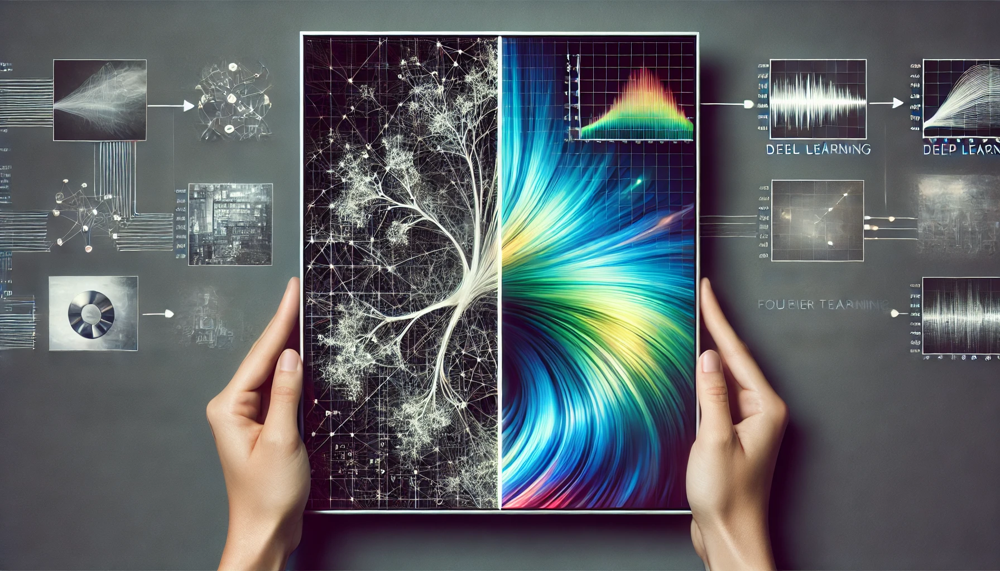
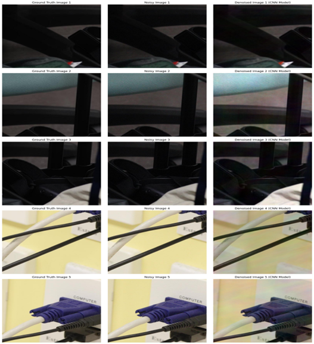
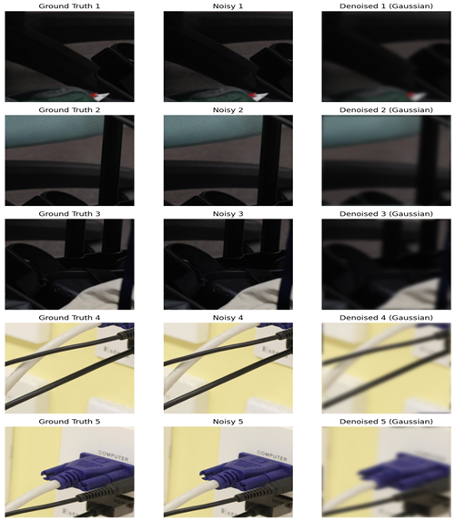
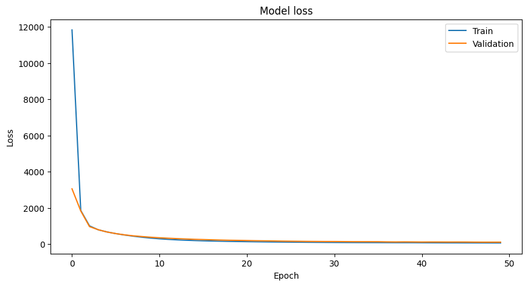

<p align="center"> 
    </img>
</p>

<h1 align="center"> DEEP Denoise 🖼️🔄</h1> 
<h3 align="center"> Transforming Noise into Clarity: Merging DEEP Learning and Fourier Techniques for Superior Image Quality. </h3>

<p align="center">
    <a href="https://numpy.org/"></a>
    <a href="https://matplotlib.org/"><a>
    <a href="https://scikit-learn.org/"></a>
    <a href="https://opencv.org/"></a>
    <a href="https://scipy.org/"></a>
    <a href="https://www.tensorflow.org/"></a>
</p>

<!-- <p align="center">If you want to discuss something, you can ask on my <a href="https://discord.com/invite/GkcbM5bwZr">Discord Server</a>.</p> -->

# 🖥️ Installation & Setup ⚙️

## Prerequisites

- Anaconda : Ensure that Anaconda is installed on your computer. Download from [Anaconda](https://www.anaconda.com/download)  
  check the installation by running the following command in the terminal:

  ```
  conda
  ```

  **Note:** In windws, you have to use Anaconda Prompt to run the above command and use conda commands

- Visual Studio Code : Ensure that Visual Studio Code is installed on your computer. Download from [VS Code](https://code.visualstudio.com/download)

## Creating a new environment

1. Creating a Conda Environment  
   Open your terminal (or Anaconda Prompt for Windows users) and execute the following command to create a new Conda environment. Replace env_name with your preferred name for the environment.

   ```bash
   conda create --name env_name python
   ```

2. Activating the Environment  
   Activate the newly created environment by running:

   ```bash
   conda activate env_name
   ```

3. Installing Packages 🛠️  
   Install the required packages using the following commands (make sure you are in the activated environment step 2.)

   ```bash
   pip install numpy matplotlib scikit-learn opencv-python scipy tensorflow==2.15.0
   ```

## Running the code in VS Code (Any other IDE)

1. **Open the Project**

   - Open the project directory in Visual Studio Code by selecting open folder from the file menu. Make sure you are in the root directory of the project soruce code which contains the README.md file.

2. **Selecting the Python Interpreter/kernel from the environment created now.**

   - Ensure that VS Code uses the Python interpreter from this Conda environment:

   - Open a Python or Notebook file.
     Click on the Python version in the status bar at the bottom or use Ctrl+Shift+P/Cmd+Shift+P and search for "Python: Select Interpreter".

   - Choose the interpreter from the "ANA_Project" environment.

3. **Running Jupyter Notebooks**

   - To run a Jupyter Notebook:

   - Open the .ipynb file.
     Execute cells individually or run the entire notebook using the play button.

# 📊 Results

## Denoising Samples with CNN and Fourier Transform



## Low Pass Filter Samples


## Gaussian Filter Samples



## Wiener Filter Samples


## Denoising Techniques Metric Performance

The table below summarizes the performance of various denoising algorithms applied to the dataset. The metrics used for evaluation are PSNR (Peak Signal-to-Noise Ratio) and SSIM (Structural Similarity Index Measure).

| **Metric**    | **Low Pass Filter** | **Gaussian Filter** | **Wiener Filter** | **CNN Model** |
| ------------- | ------------------- | ------------------- | ----------------- | ------------- |
| **PSNR (dB)** | 32.147167           | 25.241447           | 35.492706         | 24.663389     |
| **SSIM**      | 0.89117575          | 0.81881934          | 0.9085468         | 0.9027183     |

## Model Training Curves



### Insights

- **Low Pass Filter**: Shows good PSNR and SSIM values but falls short compared to advanced methods.
- **Gaussian Filter**: Has the lowest performance in terms of both PSNR and SSIM, indicating less effective denoising and structural preservation.
- **Wiener Filter**: Performs better than the Low Pass and Gaussian filters but is still outperformed by state-of-the-art methods.
- **CNN Model**: Achieves comparable SSIM to the Wiener Filter but has a significantly lower PSNR, suggesting less effective noise reduction.

# 🚀 Technical Details

## 🧑‍💻 Methodology

### 1. Data Collection

Collect various noisy and ground truth images for training and testing. The dataset consists of 100 image pairs, each with a ground truth image and a noisy image, taken from 40 different scenes shot with cameras from Canon, Nikon, and Sony.

### 2. Pre-processing

- **Fourier Transform (FT)**: Translate signals from spatial domain to frequency domain.
- **2D Fourier Transform**: Apply 2D Fourier transform to convert 2D images to frequency domain, essential for detecting and separating noise.

### 3. Applying Fourier Transform

Transform the spatial representation of an image into the frequency domain by splitting the RGB image into its three color channels. Each channel is transformed separately using the 2-dimensional Fast Fourier Transform (FFT).

### 4. Removing Noise

#### Filtering

- **Low Pass Filter**

  - **Frequency Selection**: Use a circular mask to preserve low-frequency components.
  - **Spatial Smoothness**: Reduce noise and fine details.

- **Wiener Filter**

  - **Adaptive Filtering**: Varies filtering strength based on local image and noise variation.
  - **Balance Between Inversion and Noise Reduction**: Adjust parameter `k` for optimal balance.

- **Gaussian Filter**
  - **Gaussian Blurring**: Apply Gaussian blur directly in the frequency domain.
  - **Control Over Smoothing**: Use standard deviation `sigma` for noise reduction.

#### Deep Learning Model Training

- **Preprocessing**: Pair noisy and clean images, standardize size, normalize, and transform to frequency domain.
- **Convolutional Neural Networks (CNNs)**: Process images in the Fourier domain with an architecture that includes multiple residual blocks for deeper networks.

### 5. Inverse-Fourier Transform

Transform denoised frequency components back to the spatial domain.

### 6. Performance Analysis

- Use PSNR and SSIM to quantitatively compare and assess denoising approaches.
- Benchmark against state-of-the-art methods.

### 7. Analysis

- Compare differences in PSNR and SSIM metrics.
- Identify strengths and areas for improvement.
- Evaluate each method's performance in various scenarios.

# Contributors 

<table>
  <tbody>
    <tr>
      <td align="center">
        <a href="https://github.com/charangajjala" target="_blank">
          
          <br />
          <sub><b>Charan Gajjala Chenchu</b></sub>
        </a>
      </td>
      <td align="center">
        <a href="https://github.com/sachinveera625"
          target="_blank">
          
          <br />
          <sub><b>Sachin Veeramalla</b></sub>
        </a>
      </td>
  </tbody>
</table>

# 🎟️ License

This project is licensed under the MIT License - see the [License](LICENSE) file for details.

# 📜 References & Acknowledgement

1. **Arxiv Paper on Image Denoising**:

   - Source: [https://arxiv.org/pdf/1804.02603](https://arxiv.org/pdf/1804.02603)

2. **IEEE Xplore Article**:

   - Source: [https://ieeexplore.ieee.org/abstract/document/8384706/](https://ieeexplore.ieee.org/abstract/document/8384706/)

3. **CS6640 Lectures on 2D Fourier Filtering**:

   - Source: [https://users.cs.utah.edu/~tch/CS6640/lectures/Weeks5-6/2DFourierFiltering.pdf](https://users.cs.utah.edu/~tch/CS6640/lectures/Weeks5-6/2DFourierFiltering.pdf)

4. **ScienceDirect Article**:

   - Source: [https://www.sciencedirect.com/science/article/pii/S0031320320304428](https://www.sciencedirect.com/science/article/pii/S0031320320304428)

5. **Matplotlib Documentation**:
   - Source: [https://matplotlib.org/](https://matplotlib.org/)
